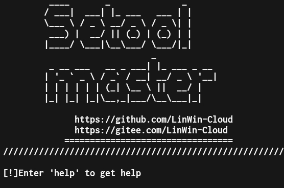

# Setool 

- Setool是一个一款命令行红队社会工程学工具,它适用于 Linux ,Android , Windows 下的社会工程学利用工具及技术改进模块及武器化.
- Setool支持多种类型开源社会工程学工具,命令行基础功能.
- Setool支持跨平台运行帮助红队工程师远程便捷协作
- Setool当前已集成多种模块,覆盖社会工程学需求工具
- Setool目标是帮助红队工程师提高攻击效率,简化操作,降低技术门槛

 
简体中文|[English](./README_EN.md)

# 更新日志

<details>
<summary><b>点击展开</b></summary>

## v1.0.0 20220818
### 优化
- 优化README.md阅读体验和排版风格
- 更新Setool个模块已知问题已修复
- 修复源代码错误和修复帮助和配置

</details>

# 安装教程
``` bash
$   git clone https://github.com/LinWin-Cloud/setool-master
$   cd setool-master
$   pip3 install whois
$   pip3 install requests
$   //源代码版本、安卓源代码版本
$   cd resources_code_vistion {or} cd Android_Resources_code
$   python3 setool.py
$   //.Linux安装包版本
$   7z x Setool-Master.7z
$   cd Setool-Master
$   cd Setool-Master
$   python3 install_linux.py
```

## 编译

  Setool 提供了编译版本（`build_vistion or Termax_Android_vistion`）
```bash
$ chmod +x ./setool
$ bash ./setool
```
# 问题反馈

- github issues : [https://github.com/LinWin-Cloud/setool-master/issues](https://github.com/LinWin-Cloud/setool-master/issues)

# 友情提醒
1. 本工具集内Web Console密码linwin用户名linwin
软件将安装在(`/var/Setool-Master`)，环境请自行配置
    

# 开源说明
Setool 基于 Apache2 协议开源。

# 致谢

Project maintenance
[Unknown404-bot](https://github.com/Unknown404-bot)
