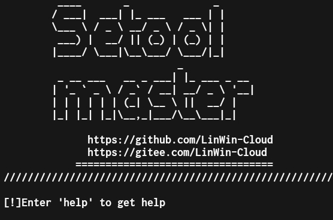

# Setool 

- Setool is a command line red team social engineering tool, which is suitable for social engineering tools, technical improvement modules and weaponization under Linux ,Android, Windows.
- Setool supports various types of open source social engineering tools, command line basic functions.
- Setool supports cross-platform operation, helping red team engineers to collaborate remotely and conveniently.
- At present, Setool has integrated various modules, covering social engineering requirements tools
- The goal of Setool is to help Red Team engineers improve attack efficiency, simplify operation and lower technical threshold
 <br>
 
English | [简体中文](./README.md)

# 

<details>
<summary><b>Click to expand</b></summary>

## v1.0.0 20220818
### optimize
- Optimize the reading experience and typesetting style of README.md
- The known problem of updating Setool modules has been fixed.
- Fix source code errors and fix help and configuration.

</details>

# Installation tutorial
``` bash
$   git clone https://github.com/LinWin-Cloud/setool-master
$   cd setool-master
$   pip3 install whois
$   pip3 install requests
$   //Source code, Android source code version
$   cd resources_code_vistion {or} cd Android_Resources_code
$   python3 setool.py
$   //Linux installation package version
$   7z x Setool-Master.7z
$   cd Setool-Master
$   cd Setool-Master
$   python3 install_linux.py
```

## edit and translate

  Setool provides a compiled version（`build_vistion or Termax_Android_vistion`）
```bash
$ chmod +x ./setool
$ bash ./setool
```
# Problem feedback

- github issues : [https://github.com/LinWin-Cloud/setool-master/issues](https://github.com/LinWin-Cloud/setool-master/issues)

# Friendly Reminder
1. The Web Console password linwin username linwin software in this tool set will be installed at (`/var/var/Setool-Master`), please configure the environment yourself.
    

# Open source description
Setool is open source based on Apache2 protocol

# express one's thanks/gratitude

Project maintenance
[Unknown404-bot](https://github.com/Unknown404-bot)
